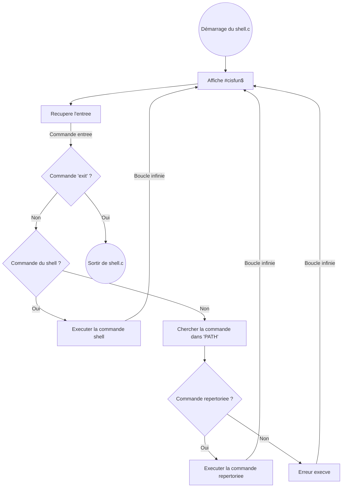

# holbertonschool-simple_shell

Un mini shell en C capable d'exécuter des commandes comme `ls`, `cd`, `exit`, etc.

## Commandes internes :
- `cd [dir]` : changer de dossier
- `exit` : quitter le shell
- `help` : afficher l’aide

## Compilation :
```bash
make
```

## Flowchart

